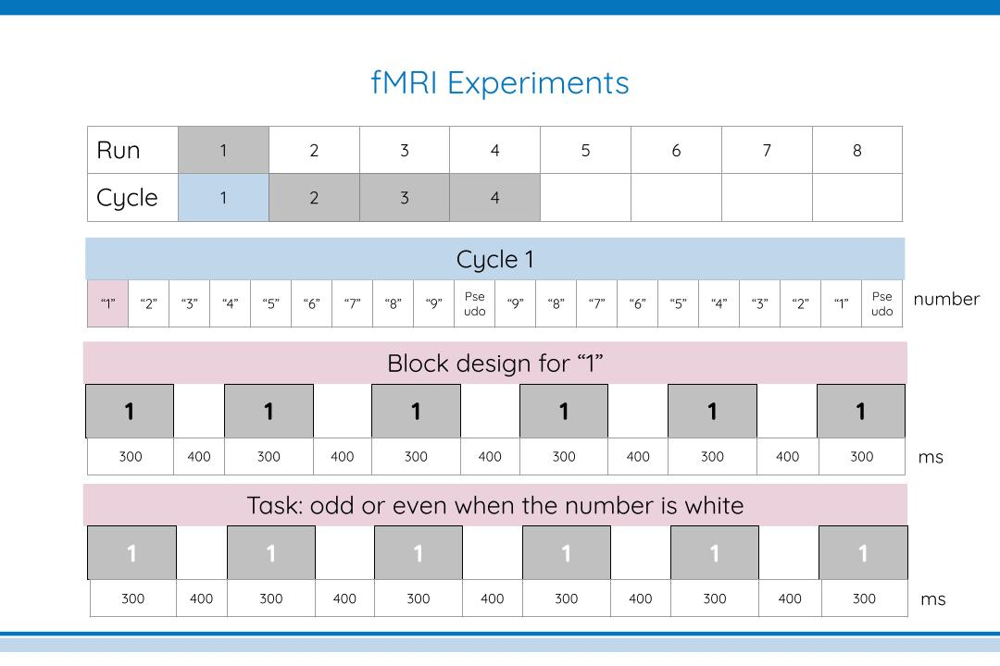

# EMPRISE2

## Overview

This repository includes all used for EMPRISE2 project.
- **NOTE:** This project has been already terminated after data collection of ten healthy adults and five adults with dyscalculia

## Table of Contents

1. [Objective](#objective)
2. [Steps for Reproducibility](#steps-for-reproducibility)
3. [Directory Structure](#directory-structure)
4. [Contact](#contact)


## Objective

The objective of this project was to:
- Explore numerosity maps in dyscalculia.

Methods:
- 10 adults
- 5 dyscalculia
- fMRI
- Psychopy
- Modeling approach

Figures:


## Steps for Reproducibility

This section outlines the general pipeline.

### 1. Analyze the preprocessed fMRI data
Detailed steps for the data analysis are described in the following folder
```bash
EMPRISE2/code
```

## Directory Structure
```bash
EMPRISE2/
    ├── behav/   # task response .csv files
    │
    ├── code/   # scripts for data analysis 
    │
    ├── experiment/ # psychopy scripts and stimuli
    │
    ├── figures/ # figures
    │
    ├── matlab/spm # matlab-based functions 
    ├── .gitignore # ignore some folders not to upload to GitHub.
    ├── README.md
```

## Contact
If you have any questions, feel free to ask me!
 ```bash
kazuki@cbs.mpg.de
 ```